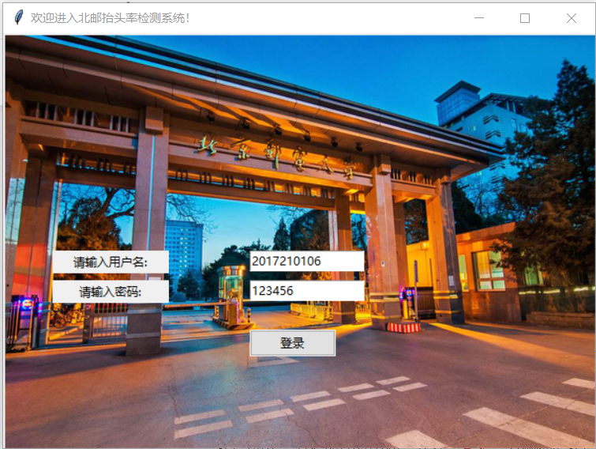
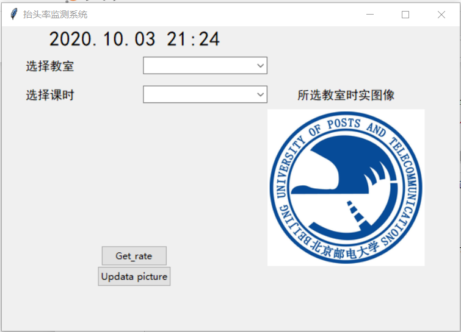

# 抬头率检测系统

[](https://github.com/RichardLitt/standard-readme)

本仓库设计并实现了一个简易的抬头率检测系统，通过调用摄像头来获取教室的实时图像，对图像进行人脸识别，并结合数据库中的选课人数计算该堂课的实时抬头率。此外，我们还设计了一个UI操作界面，以便管理人员浏览和管理。

本仓库包含以下内容：

1. 系统运行所需要的全部源码（共有ipython和py两种文件格式，均可独立完整运行）
2. 人脸识别所需要的训练好的[模型文件](./haarcascade_frontalface_alt2.xml)
3. 运行测试所需要的图片和数据

## 目录

- [内容简介](#内容简介)
	- [代码功能介绍](#代码功能介绍)
	- [关键代码讲解](#关键代码讲解)
  - [运行说明和结果展示](#)
- [参考资料](#参考资料)
- [相关仓库](#相关仓库)
- [维护者](#维护者)
- [如何贡献](#如何贡献)

## 内容简介
### 代码功能介绍
本文档中仅介绍.ipython文件，对应的.py文件不再赘述，内容都是一样的。

#### [camera.ipynb](./camera.ipynb)
此代码实现了调用摄像头以截取某一时刻的图像，并将其储存在本地的功能。

#### [code0_initial.ipynb](./code0_initial.ipynb)
这个代码就是最原始的主体代码，人脸识别部分主要参考了dlib的一个样例程序，代码里还保留着一些原始的英文注释，讲解了一下环境配置中可能出现的问题，有兴趣的可以看一看。

#### [code1_window_and_face_recognition.py.ipynb](./code1_window_and_face_recognition.py.ipynb)
此代码是第一个较为完整地代码，已经可以完整地运行出来，并带了UI界面。

#### [code2_password_final.ipynb](./code2_password_final.ipynb)
正如这个代码的文件名，它就是在上一个版本的代码中加入了登录界面，并完善了代码的各项功能，是本系统最终使用的代码。嫌麻烦的完全可以不看前两个版本的代码，直接看这个最终版就行。

代码主要由三大部分组成：界面代码、人脸检测代码以及数据调用代码。

界面代码是用的tkinter库，人脸检测代码也是直接调用的opencv的一个人脸检测的接口，调用训练好的模型之后直接对图片infer就行了。数据调用代码主要调用两种数据，分别是课堂信息和教室的实时图片。前者被用来进行抬头率检测，后者用来将教室的实时图像显示在UI界面上，以便观察和对照。

### 关键代码讲解
其实整个代码也比较简单，没啥好讲的，基本是界面的代码，我就讲一下最核心的功能，人脸检测函数吧。
```sh
def inspect():  ## 声明一个函数
    nonlocal face ## 将face变量定义为全局，这样就不用再把face给return了，函数里跑出的face值，函数外也能获得，可以保证face值得实时性
    str1 = "教室"
    str2 = "课上的抬头率为："
    path = r'.\faces' ## 图片保存的路径
    pic_path = str(class_room_chosen.get()) + str(course_time_chosen.get()) + '.jpg' ## 根据选择的教室和时间获取相应图片的名称 （图片的名称是需要按一定的规则来命名的，否则会报错）
    p = path + '/' + pic_path  ## 将图片的总路径和单个图片的名称拼接起来，得到单个图片的路径
    img = cv2.imread(p)  ## 读取图片
    color = (0, 255, 0)  

    grey = cv2.cvtColor(img, cv2.COLOR_BGR2GRAY)  ## 只选取单个通道的图片数据进行处理，就是把彩图变成灰度图

    classfier = cv2.CascadeClassifier(
                r".\haarcascade_frontalface_alt2.xml") ## 创建一个分类器，这个分类器是已经训练好的，调用了一个已经训练好的模型文件
    faceRects = classfier.detectMultiScale(grey, scaleFactor=1.2, minNeighbors=3, minSize=(32, 32)) ## 通过分类器对图像进行人脸识别
    a = len(faceRects) ## faceRects有几条数据，就说明有几个人脸，从而判断出有几个人抬头了
    face = a
    str3 = str(a) ## 改变数据格式，以便后面将其输出在UI界面上
```
### 运行说明和结果展示

#### 运行说明
编码语言：python3.7
编程环境: Jupyter notebook
主要依赖库: Opencv

#### 结果展示

首先是登录界面：



因为时间原因，本系统并未真正实现密码验证功能，有兴趣的小伙伴可以结合mysql数据库等等来实现这一功能。

其次是系统的初始化界面，也就是登录之后会跳转到的界面：



最后就是抬头率的结果展示画面，在选取了相应的教室和时间后，依次点击界面上的两个按钮，就可以显示出抬头率，并在侧面显示出教室的实时图像：


## 参考资料
本系统只是简单地实现了一个功能齐全的抬头率检测管理系统，但是并未对各项功能的准确率和效率进行优化，如果有对准确率和效率有更高要求的小伙伴，可以去找一些相关的人脸识别的参考文献，本仓库中附带了一篇本人看过的文献，思路与我的这个系统较为类似，但是做的更加深入、细致，也有各种准确率等等的指标，文章已经附在仓库中，点击[链接](./reference/面向大学课堂的抬头率检测系统的研究与实现_张杰.caj)即可获得全文。


## 相关仓库

- [Standard Readme](https://github.com/RichardLitt/standard-readme) — 💌 写高质量 README 的艺术。

## 维护者

[@bupt_caidongqi](https://github.com/caidongqi)。

## 如何贡献

非常欢迎你的加入！[提一个 Issue](https://github.com/caidongqi/Industrial-Applet/issues/new) 或者提交一个 Pull Request。


### 贡献者

感谢以下参与项目的人：
